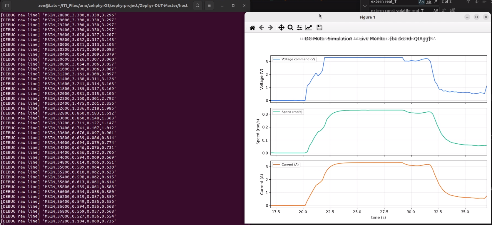

# Zephyr-DUT-Master

## Zephyr Testbench — DUT Test Automation with Robot Framework

A USB-connected STM32F401CC "Black Pill" testbench, running Zephyr OS, that exposes its peripherals (**GPIO**, **ADC**, **SPI**, **UART**, **PWM**) as Zephyr shell commands. Robot Framework drives it over a serial connection to run automated hardware tests against any Device Under Test (DUT). A built-in DC **motor plant** simulation (**generated** from a **MATLAB Simulink model**) lets the testbench stand in for a real motor, so you can closed-loop test a DUT's motor controller without any physical motor attached.

```
┌──────────────────┐   USB-TTL UART    ┌──────────────────────┐   wires    ┌─────────┐
│  Host PC         │ ◄───────────────► │  STM32F401CC         │ ◄────────► │   DUT   │
│  Robot Framework │   shell commands  │  Zephyr OS           │  GPIO/ADC  │         │
│  / Python tools  │   ("tb ...")      │  Testbench firmware  │  SPI/UART  │         │
└──────────────────┘                   └──────────────────────┘    /PWM    └─────────┘
```

------

## Live data plotting from Motor Generated Code on the DUT-Master



## What's in this repo

| Area             | Path                       | Description                                                  |
| ---------------- | -------------------------- | ------------------------------------------------------------ |
| Firmware         | `DUT_Master/`              | Zephyr application: shell command tree (`tb gpio`, `tb adc`, `tb spi`, `tb uart`, `tb pwm`, `tb motorsim`) |
| Host library     | `host/ZephyrShellLib/`     | Robot Framework library — every shell command as a keyword   |
| Test suites      | `host/tests/`              | `.robot` suites: GPIO, ADC, SPI, UART, PWM, motor simulation, soak tests |
| Fixtures         | `host/fixture/`            | Per-DUT wiring descriptors (YAML)                            |
| Standalone tools | `host/standalone_monitor/` | Live plotting script, independent of Robot Framework         |
| Unit tests       | `host/tests_unit/`         | Pure-Python tests, no hardware required                      |

------

## Quick start

### 1. Flash the firmware

```bash
cd DUT_Master
west build -b blackpill_f401cc
west flash --runner stm32cubeprogrammer
```

Wire a USB-TTL dongle to USART1 (PA9/PA10) for the shell connection — this is separate from the ST-Link used for flashing. See the full implementation plan for pin assignments and DTS overlay details.

### 2. Set up the host

```bash
cd host
python3 -m venv .venv && source .venv/bin/activate
pip install -r requirements.txt
```

### 3. Verify the connection

```bash
# Manual sanity check with any serial terminal:
screen /dev/ttyUSB0 115200
# Type: tb ping   -> should reply "pong"
# Ctrl+A, K to exit screen
```

### 4. Run the tests

```bash
make unit-test                       # no hardware needed
make test PORT=/dev/ttyUSB0          # all suites except soak
make test-gpio PORT=/dev/ttyUSB0     # a single suite
```

Or call Robot Framework directly:

```bash
PYTHONPATH=. robot --outputdir results \
    --variable PORT:/dev/ttyUSB0 \
    tests/gpio_tests.robot
```

Open `results/report.html` and `results/log.html` for the test report.

------

## How the shell protocol works

The testbench firmware runs Zephyr's built-in shell subsystem over UART. Every testbench operation is a `tb <peripheral> <action> ...` command:

```
blackpill:~$ tb gpio set PA5 1
OK
blackpill:~$ tb adc read PA0
1842 mV
blackpill:~$ tb spi xfer 0 DE AD
DE AD
blackpill:~$ tb pwm capture PA1
999 Hz 49 pct
```

`ZephyrShellLib` (the Robot Framework library) wraps each command: sends it, reads until the shell prompt reappears, strips the echo and prompt, and returns the result. Responses starting with `ERROR:` automatically become a Robot Framework test failure.

> **Prompt string matters.** If you customized `CONFIG_SHELL_PROMPT_UART` in your firmware (this project uses `blackpill:~$ ` instead of Zephyr's default `uart:~$ `), make sure `ZephyrShellLib`'s `prompt=` argument — or `transport.py`'s `DEFAULT_PROMPT` — matches exactly. A mismatch here causes every command to silently time out.

------

## Writing a test suite

```robot
*** Settings ***
Library    ZephyrShellLib    port=/dev/ttyUSB0    baud=115200

*** Test Cases ***
GPIO output drives high
    GPIO Set    PA5    1
    ${val}=    GPIO Get    PB3
    Should Be Equal    ${val}    1

ADC reads valid voltage
    ${mv}=    ADC Read MV    PA0
    Should Be True    ${mv} >= 100 and ${mv} <= 3200
```

Reusable patterns live in `host/tests/resources/` — import `patterns_gpio.resource`, `patterns_uart.resource`, or `patterns_power.resource` for higher-level keywords like `GPIO Toggle And Verify`, `UART Boot Sequence Check`, and `Power Cycle DUT` instead of writing raw command sequences yourself.

### Using a fixture file instead of hardcoded pins

```robot
*** Settings ***
Library    ZephyrShellLib    fixture=fixture/sensor_board_fixture.yaml

*** Test Cases ***
Reset line pulses correctly
    ${reset_pin}=    Get Fixture Pin    reset
    GPIO Set    ${reset_pin}    0
```

The fixture YAML maps logical signal names to physical pins per DUT revision, and is checked for pin conflicts at load time — see `host/fixture/sensor_board_fixture.yaml` for the format.

------

## The DC motor plant simulation

The firmware embeds a DC motor model (current + speed, 2 continuous states) generated by Simulink Coder from a plain (non-Simscape) Simulink model, so it runs natively on Cortex-M with no external runtime dependency. `tb motorsim` commands let the testbench act as a virtual motor: it reads a voltage command from the DUT (via ADC or PWM, selectable at runtime) and reports back simulated speed/current.

```
tb motorsim start <adc|pwm> <pin> [vmax_mv]
tb motorsim stop
tb motorsim get
tb motorsim stream <on|off>
tb motorsim source <adc|pwm> <pin>
tb motorsim params <R> <L> <J> <K> <b>
```

Robot Framework:

```robot
Motorsim Start    adc    PA0    3300
Sleep    2s
${state}=    Motorsim Get
Should Be True    ${state}[speed_radps] > 0
```

Source (ADC vs PWM) is a runtime parameter, not a firmware rebuild — set it from the command line:

```bash
robot --variable INPUT_SOURCE:pwm --variable INPUT_PIN:PA1 \
      tests/motorsim_tests.robot
```

### Live plotting outside Robot Framework

```bash
python3 host/standalone_monitor/motorsim_monitor_wayland.py \
    --port /dev/ttyUSB0 --source adc --pin PA0
```

Opens a live 3-panel plot (voltage / speed / current) via Qt, useful for interactive tuning and demos independent of any test run.

------

## Using this testbench with MATLAB / Simulink for control design

This section covers the workflow for people doing **control design** work: tuning a DUT's motor controller in MATLAB, validating it against the embedded plant model, and optionally closing the loop live between MATLAB and the physical testbench hardware.

### Why the plant lives on the testbench, not in MATLAB

In a normal MATLAB-only workflow, you'd simulate your motor model and your controller together, entirely in software. Here, the *plant* (the motor) runs on real embedded hardware (the STM32), driven by your *controller*, which can live in MATLAB **or** on the real DUT. This gives you a hardware-in-the-loop (HIL) setup with the cost and complexity of just one extra microcontroller, not a dedicated HIL rig.

Three ways to use it, in increasing order of realism:

| Mode | Controller runs on | Plant runs on   | Use case                                                     |
| ---- | ------------------ | --------------- | ------------------------------------------------------------ |
| A    | MATLAB/Simulink    | STM32 testbench | Tune a controller in MATLAB against real embedded-plant dynamics |
| B    | Real DUT hardware  | STM32 testbench | Validate the DUT's actual firmware controller, no motor needed |
| C    | Real DUT hardware  | Real motor      | Final validation, testbench out of the loop entirely         |

This repo's Robot Framework suites exercise **Mode B**. The rest of this section covers **Mode A** — driving the testbench plant directly from MATLAB.

### Mode A: MATLAB controller, testbench plant

The testbench's shell is just a serial command interface, so MATLAB can talk to it directly with `serialport`, without Robot Framework or Python in the loop at all.

```matlab
% connect_testbench.m
s = serialport("/dev/ttyUSB0", 115200);
configureTerminator(s, "CR/LF");
flush(s);

% Start the plant simulation: testbench reads voltage commands via ADC on PA0
writeline(s, "tb motorsim start adc PA0 3300");
disp(readline(s));   % "OK source=adc pin=PA0 vmax_mv=3300 step_ms=200"
```

A minimal control loop, where MATLAB computes the controller output and writes it back to the testbench's command pin would need an external DAC/PWM source under MATLAB's control (e.g. an Arduino, NI-DAQ, or a second microcontroller acting as MATLAB's analog output) since the testbench's ADC input pin needs to be physically driven by *something*. The simplest bench setup:

```
MATLAB  ──(USB)──  Arduino/DAQ  ──(analog out, PA0)──  STM32 testbench (plant)
   ▲                                                          │
   └──────────────── tb motorsim get  (speed feedback) ───────┘
                         via serialport
```

Polling loop in MATLAB:

```matlab
% control_loop.m
Kp = 0.5; Ki = 2.0;
integral = 0;
speed_setpoint = 200;   % rad/s
dt = 0.2;                % matches the firmware's 200ms model step

for k = 1:100
    writeline(s, "tb motorsim get");
    resp = readline(s);   % "t_ms=... voltage_v=... speed_radps=... current_a=..."
    fields = regexp(resp, '(\w+)=([\d.\-]+)', 'tokens');
    state = struct();
    for i = 1:numel(fields)
        state.(fields{i}{1}) = str2double(fields{i}{2});
    end

    error = speed_setpoint - state.speed_radps;
    integral = integral + error * dt;
    control_output = Kp * error + Ki * integral;   % drive this to your DAC

    % write control_output to your external DAC here, feeding PA0

    pause(dt);
end

writeline(s, "tb motorsim stop");
clear s
```

For most control-design workflows it's simpler to skip the external DAC and instead **log the testbench's response to an open-loop voltage step**, then do your controller design and validation entirely in MATLAB using that real plant data — see the next section.

### Recommended workflow: system identification from real hardware

1. **Capture a step response from the real embedded plant** using the CSV logging built into the standalone monitor:

   ```bash
   python3 host/standalone_monitor/motorsim_monitor_wayland.py \
       --port /dev/ttyUSB0 --source adc --pin PA0 --csv step_response.csv
   ```

   While it's running, apply a voltage step on PA0 (a bench supply, a second microcontroller, or a simple potentiometer) and let it log for a few seconds.

2. **Import the CSV into MATLAB** and use System Identification Toolbox to fit/verify the plant transfer function:

   ```matlab
   data = readtable("step_response.csv");
   t = data.t_ms / 1000;
   v = data.voltage_v;
   w = data.speed_radps;
   
   sys_data = iddata(w, v, mean(diff(t)));
   sys_est = tfest(sys_data, 2);   % fit a 2nd-order transfer function
   compare(sys_data, sys_est);
   ```

   Since the embedded plant is the exact `dc_motor_math` Simulink model running on the STM32, this should closely match the transfer function you'd derive analytically from `R`, `L`, `J`, `K`, `b` — it's a good sanity check that the firmware integration is correct, and a realistic source of "real" data with actual ADC quantization noise and timing jitter baked in.

3. **Design your controller in MATLAB** (PID Tuner, Control System Designer, or your own loop-shaping) against either the identified transfer function or the original `dc_motor_math` parameters directly.

4. **Re-generate your controller as C code** with Embedded Coder and deploy it to the actual DUT — now the DUT's *real* controller can be tested against the testbench's plant simulation using the Robot Framework suites in this repo (`tests/motorsim_tests.robot`), which is Mode B from the table above: closed-loop validation entirely on hardware, with the testbench as the only stand-in component.

### Regenerating or modifying the plant model

The plant model in `DUT_Master/src/model/dc_motor_math.c` was generated from a plain (non-Simscape) Simulink model — two `Transfer Fcn`/Integrator blocks for armature current and rotor speed, with `Gain` blocks for `Kt`/`Ke`/`R`/`L`/`J`/`b`. If you need to change the plant dynamics:

1. Edit the model in Simulink (`dc_motor_math.slx` or equivalent).
2. Configuration Parameters → Solver: keep a fixed-step solver (`ode3` or similar) with a fixed step size — the firmware calls `dc_motor_math_step()` on a periodic Zephyr timer matching this step size (`MOTORSIM_STEP_MS` in `tb_motorsim.c`, currently 200 ms to match `dc_motor_math_M->Timing.stepSize0 = 0.2`).
3. Regenerate with **ert.tlc**, target **ARM Compatible → ARM Cortex-M**.
4. Copy the regenerated `dc_motor_math.c/h`, `dc_motor_math_types.h`, `dc_motor_math_private.h`, and `rtwtypes.h` into `DUT_Master/src/model/`, replacing the existing files.
5. Update `DUT_Master/src/model/dc_motor_math_params.c` if you added or renamed any `extern` parameters — Simulink Coder declares these as `extern` but does **not** generate a definition for them in this export configuration; that file is the one hand-written exception in the whole codebase and must be kept in sync by hand.
6. Rebuild and reflash: `west build -b blackpill_f401cc && west flash`.

> **Important:** verify the generated `dc_motor_math.c` does **not** reference `nesl_rtw.h` or any `*_gateway.h` file before building. Those indicate the model still uses Simscape blocks, which depend on a desktop-only runtime library and will not link for ARM Cortex-M. If you see those includes, replace the Simscape block(s) in your model with plain Simulink `Transfer Fcn`/`Integrator`/`Gain` blocks implementing the same equations.

------

## Project structure reference

```
.
├── DUT_Master/                              Zephyr firmware
│   ├── CMakeLists.txt
│   ├── prj.conf
│   ├── boards/blackpill_f401cc.overlay
│   └── src/
│       ├── main.c
│       ├── tb_cmds.c                 central shell command registration
│       ├── tb_gpio.c / tb_adc.c / tb_spi.c / tb_uart.c / tb_pwm.c
│       ├── tb_motorsim.c / .h        motor plant simulation + shell commands
│       └── model/
│           ├── dc_motor_math.c/.h    Simulink-generated plant model
│           ├── dc_motor_math_types.h
│           ├── dc_motor_math_private.h
│           ├── dc_motor_math_params.c  (hand-written: defines extern params)
│           └── rtwtypes.h
│
├── host/
│   ├── ZephyrShellLib/                Robot Framework library
│   │   ├── __init__.py
│   │   ├── transport.py               serial + shell prompt parsing
│   │   ├── peripheral_keywords.py     GPIO/ADC/SPI/UART/PWM keywords
│   │   ├── motorsim_keywords.py       motor simulation keywords
│   │   └── fixture_loader.py          YAML wiring descriptor loader
│   ├── fixture/
│   │   └── sensor_board_fixture.yaml
│   ├── tests/
│   │   ├── resources/                 reusable keyword patterns
│   │   ├── gpio_tests.robot
│   │   ├── adc_tests.robot
│   │   ├── spi_tests.robot
│   │   ├── uart_tests.robot
│   │   ├── pwm_tests.robot
│   │   ├── motorsim_tests.robot
│   │   └── soak_tests.robot
│   ├── tests_unit/                    pytest, no hardware needed
│   ├── standalone_monitor/            live plotting, independent of Robot Framework
│   ├── requirements.txt
│   └── Makefile
│
└── README.md   (this file)
```

------

## Troubleshooting

**`TimeoutError: No shell prompt after ...`** — your firmware's shell prompt doesn't match `ZephyrShellLib`'s expected prompt string. Check `CONFIG_SHELL_PROMPT_UART` in `prj.conf` and pass the matching `prompt=` argument when importing the library, or update `transport.py`'s `DEFAULT_PROMPT`.

**`No keyword with name '...' found`** immediately after a library import error — this is a downstream symptom, not a separate bug. If `ZephyrShellLib.__init__` raises (commonly the prompt mismatch above), Robot Framework never finishes creating the library instance, so none of its keywords exist for that test run. Fix the underlying import error first; the keyword errors disappear on their own.

**`samples=0` in the live monitor / no `MSIM,...` lines arriving** — check that the firmware writes the stream output directly to the shell UART via `uart_poll_out()` rather than `printk()`. Zephyr's log subsystem can prefix, buffer, or drop `printk` output, which silently breaks the streaming protocol. See `host/standalone_monitor/FIRMWARE_FIX_README.txt` for the exact fix.

**Link error referencing `nesl_\*` or `\*_gateway.h` symbols** — your Simulink model still contains a Simscape block. See "Regenerating or modifying the plant model" above.